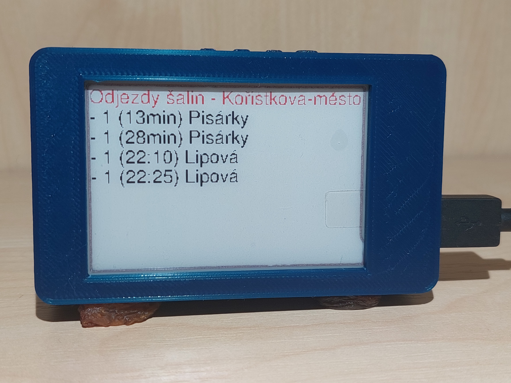
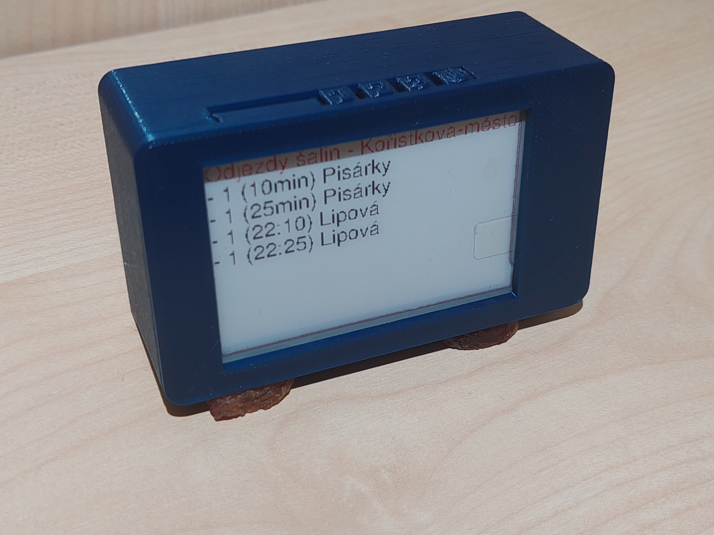

# E-paper panel

About the project - EN

This project aims to design and create a universal home panel. The main task of this panel is to display the current departures of urban public transport. Thanks to a wireless connection to WiFi and communication with processing servers, the display is able to show any data and simplify user accessibility to daily information.

System components:

- [x] [Departures of the Urban Public Transport - Brno](https://jakubandrysek.github.io/E-paper-board-ESP32/aplikace/mhd)
- [x] [Latest Grades from School](https://jakubandrysek.github.io/E-paper-board-ESP32/aplikace/sol-znamky)
- [x] [Weather Forecast - Alojz](https://jakubandrysek.github.io/E-paper-board-ESP32/aplikace/alojz)
- [x] [Use of Machines in FabLab](https://jakubandrysek.github.io/E-paper-board-ESP32/aplikace/fablab)
- [ ] [Current School Schedule](https://jakubandrysek.github.io/E-paper-board-ESP32/aplikace/sol-rozvrh)
- [ ] ...

<a href="https://jakubandrysek.github.io/E-paper-board-ESP32/" target="_blank"><h3 align="center">DOCUMENTATION - CZ</h3></a>

## Basic Information

The home panel was built on the [LilyGo-T5-Epaper](https://github.com/Xinyuan-LilyGO/LilyGo-T5-Epaper-Series) module, which is a very significant combination of a powerful ESP32 microcontroller and a tri-color E-paper display.

### ESP32

ESP32 is a powerful microcontroller that has WiFi and Bluetooth connectivity.

### E-paper display

For my project, I chose a decent tri-color display with a size of 2.7 inches. This display has a resolution of 264 by 176 pixels.

## More information in the [complete documentation](https://jakubandrysek.github.io/E-paper-board-ESP32/)
</pre>

O projektu - CZ

Cílem tohoto projektu je navrhnout a vytvořit univerzální domácí panel. Hlavním úkolem tohoto panelu je zobrazovat aktuální odjezdy městské hromadné dopravy. Díky bezdrátovému připojení na WiFi a komunikací se zpracujícím servery je displej schopen zobrazit jakékoliv údaje a zjednodušit tak uživateli přístupnost ke každodenním informacím.

Součásti systému:

- [x] [odjezdy MHD - Brno](https://jakubandrysek.github.io/E-paper-board-ESP32/aplikace/mhd)
- [x] [nejnovější známky ze školy](https://jakubandrysek.github.io/E-paper-board-ESP32/aplikace/sol-znamky)
- [x] [předpověď počasí Alojz](https://jakubandrysek.github.io/E-paper-board-ESP32/aplikace/alojz)
- [x] [využití strojů ve FabLabu](https://jakubandrysek.github.io/E-paper-board-ESP32/aplikace/fablab)
- [ ] [aktuální školní rozvrh](https://jakubandrysek.github.io/E-paper-board-ESP32/aplikace/sol-rozvrh)
- [ ] …

<a href="https://jakubandrysek.github.io/E-paper-board-ESP32/" target="_blank"><h3 align="center">DOKUMENTACE</h3></a>

## Základní informace

Domácí panel je postaven na modulu [LilyGo-T5-Epaper](https://github.com/Xinyuan-LilyGO/LilyGo-T5-Epaper-Series) který tvoří velmi významnou kombinaci mezi výkonným mikrokontrolérem ESP32 a tříbarevným E-paper displejem.

### ESP32

ESP32 je výkonný mikrokontrolér, který disponuje konektivitou WiFi a Bluetooth.

### E-paper displej

Do svého projektu jsem si zvolil decentní tříbarevný displej s velikostí 2,7 palců. Tento displej má rozlišení 264 na 176 bodů.

## Více informací v [kompletní dokumentaci](https://jakubandrysek.github.io/E-paper-board-ESP32/)

</pre>

