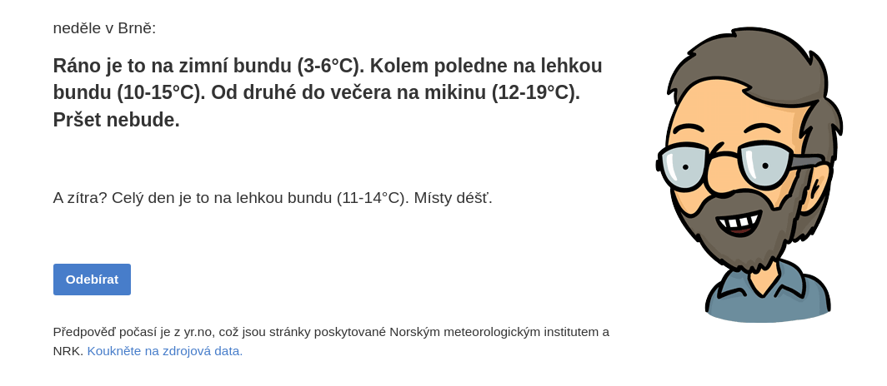
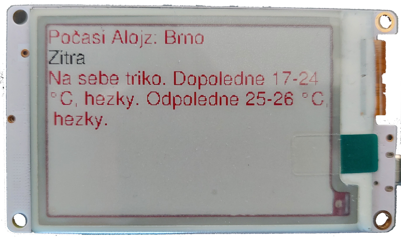

# Předpověď počasí Alojz

Mezi další moduly patří moje oblíbená webová stránka [Alojz.cz](https://alojz.cz/brno) od českého programátora [Filipa Hráčka](https://filiph.net/). Web Alojz získává data o&nbsp;počasí z&nbsp;norského webu [Yr.no](https://www.yr.no/) a&nbsp;pomocí umělé inteligence je transformuje do českých vět. Pro tento web bude nutné navrhnout webový parser na formát JSON.

