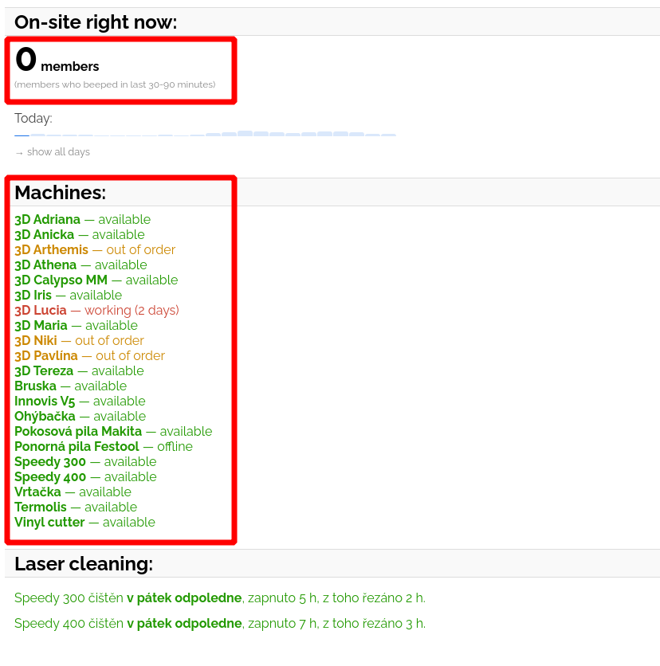
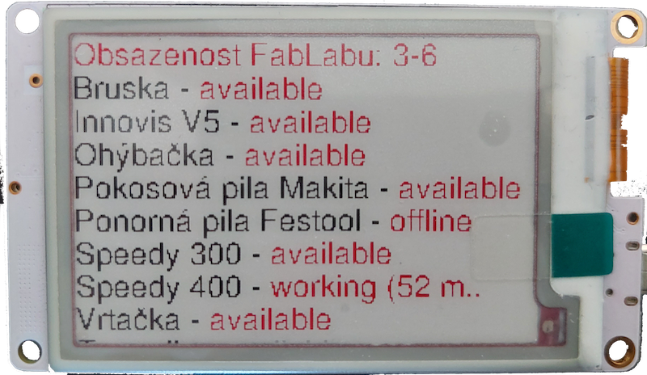

# FabLab now

Tento modul zobrazuje využití strojů ve [FabLabu](https://www.fablabbrno.cz/).

FabLab Brno je otevřená digitální dílna v&nbsp;Brně, ve které je možné pracovat například s&nbsp;3D tiskárnami, laserem, nebo s&nbsp;obráběcím strojem.
Stroje jsou přístupné na uživatelské karty a&nbsp;během dne bývají vcelku vytížené, proto Core team FabLabu vytvořil web [FabLab now](https://now.fablabbrno.cz/), který zobrazuje obsazenost FabLabu a&nbsp;konkrétních strojů.

## Využití FabLabu

Pro zpracování dat z&nbsp;webu FabLabu používám Wrapper - [více informací](../wrapper/fablab.md)

