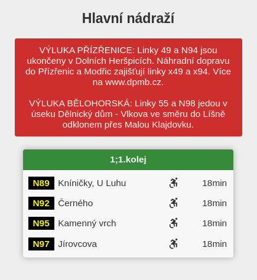
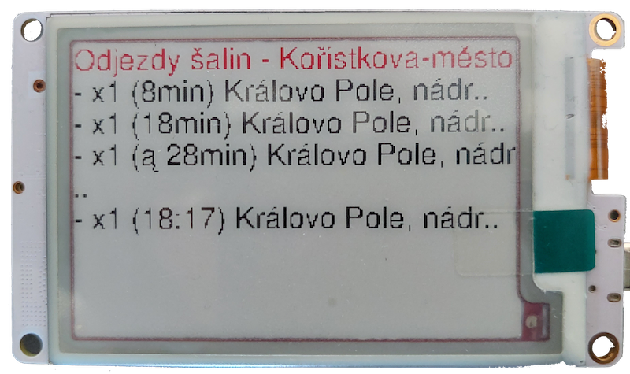

# Odjezdy MHD

Hlavním modulem a&nbsp;prvotním nápadem na vytvoření tohoto projektu je aplikace na zobrazování odjezdů MHD. V&nbsp;mém případě konkrétně v&nbsp;Brně - Jihomoravském kraji. Tento modul vytvářím ve spolupráci s&nbsp;[IDSJMK](https://idsjmk.cz/). Díky čemuž jsem získal neomezený přístup k&nbsp;veřejnému API na webu [https://mapa.idsjmk.cz](https://mapa.idsjmk.cz/).

## Odjezdy ze zastávky

Hlavním požadavkem na tohoto moduli je rychlé a&nbsp;jednoduché zobrazení odjezdů MHD z&nbsp;přednastavených zastávek.
V&nbsp;aktuální verzi aplikace zobrazuje dvě nejbližší zastávky od domu.

Na displeji je vidět odjez do obou směrů.

