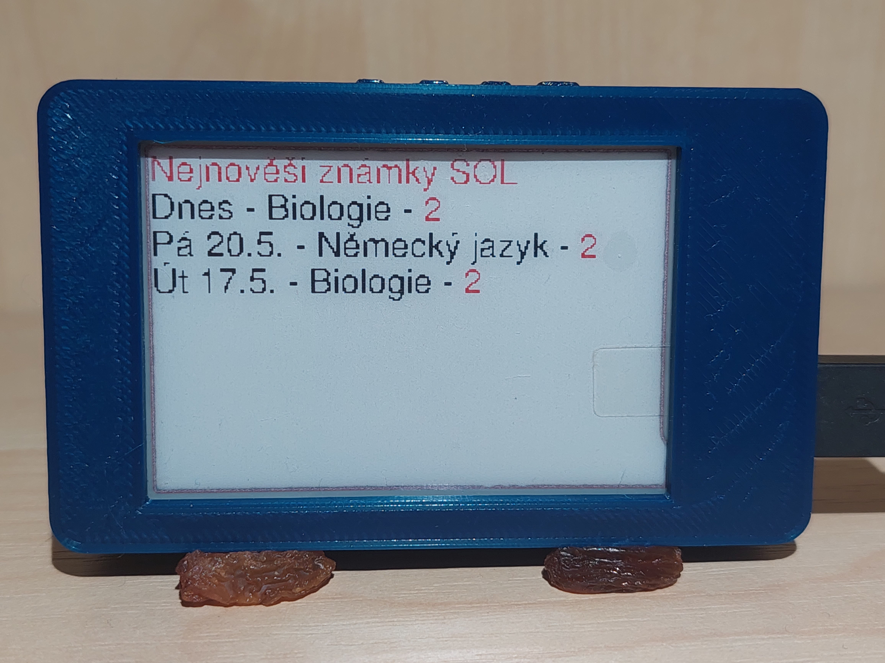

# ŠOL známky

Naše škola využívá velmi rozšířený informační systém [Škola Online](https://www.skolaonline.cz/) [ŠOL].
Pro přístup do tohoto systému je možné využít standardní webové rozhraní nebo vcelku pomalou mobilní aplikaci.

## Posledí přidané známky

Tato aplikace zajišťuje zobrazování nejnovějších známek ze školních systému.
Jelikož ESP32 nezvládá přímou komunikaci s&nbsp;informačním systémem, stojí mezi nimi pythonní wrapper - aplikace, která získá data ze školního systému a&nbsp;vrátí JSON který obsahuje pouze nejnutnější data.

