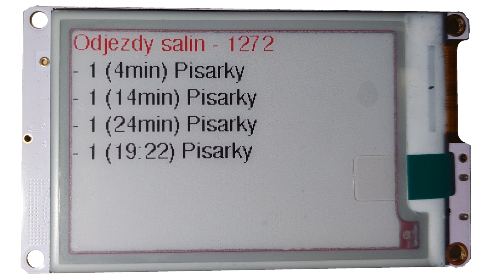

# E-paper panel

Cílem tohoto projektu je navrhnout a vytvořit univerzální domácí panel. Hlavním úkolem tohoto panelu je zobrazovat aktuální odjezdy městské hromadné dopravy. Díky bezdrátovému připojení na WiFi a komunikací se zpracujícím servery je displej schopen zobrazit jakékoliv údaje a zjednodušit tak uživateli přístupnost ke každodenním informacím.

Součásti systému:

- [x] [odjezdy MHD - Brno](aplikace/mhd.md)
- [x] [nejnovější známky ze školy](aplikace/sol-znamky.md)
- [ ] [aktuální školní rozvrh](aplikace/sol-rozvrh.md)
- [ ] [předpověď počasí Alojz](aplikace/alojz.md)
- [ ] [využití strojů ve FabLabu](aplikace/fablab.md)
- [ ] …

## Základní informace

Domácí panel je postaven na modulu [LilyGo-T5-Epaper](https://github.com/Xinyuan-LilyGO/LilyGo-T5-Epaper-Series) který tvoří velmi velmi významnou kombinaci mezi výkonným mikrokontrolérem ESP32 a tříbarevným E-paper displejem.

### ESP32

ESP32 je výkonný mikrokontrolér, který disponuje konektivitou WiFi a Bluetooth.

### E-paper displej

Do svého projektu jsem si zvolil decentní tříbarevný displej s velikostí 2,7 palců. Tento displej má rozlišení 264 na 176 bodů.