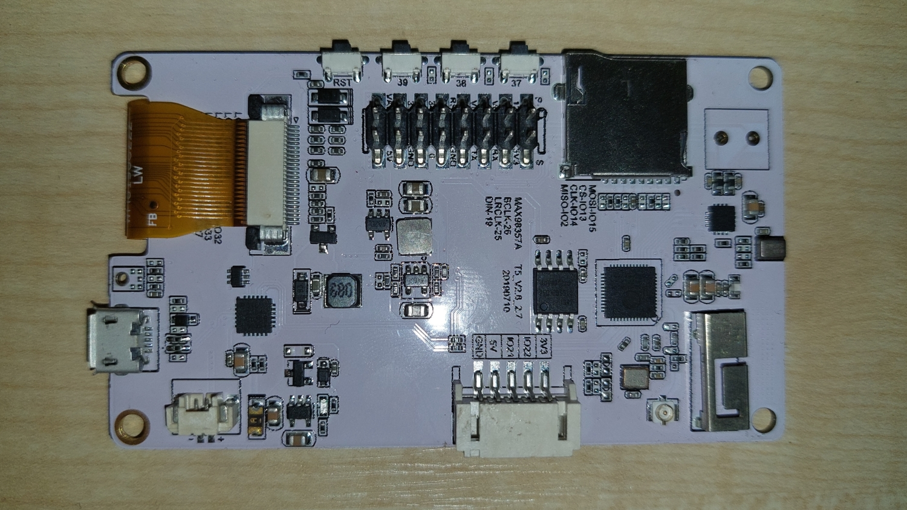

# Panel

## Hardware

Domácí panej je postaven na modulu [LilyGo-T5-Epaper](https://github.com/Xinyuan-LilyGO/LilyGo-T5-Epaper-Series) který tvoří velmi velmi významnou kombinaci mezi výkonným mikrokontrolérem ESP32 a tříbarevným E-paper displejem.

## Software

Hlavní aplikace pro E-paper panel je naprogramovaná v jazyce C++. Jako vývojové prostředí používám [PlatformIO](https://platformio.org/platformio-ide), které má přímou podporu pro programování mikročipu ESP32.

Pro svůj vývoj jsem zvolil Arduino framework, pro který existuje mnoho komunitou spravovaných knihoven, které zjednoduší celkový vývoj.

### Návrhový vzor

Aplikaci jsem vytvořil jako objektivně orientovanou. Program se tedy skládá z mnoha objektů, které mezi sebou komunikují.

Díky tomu je možné oddělit logiku aplikace od konkrétní implementace.

### [Vstupy panelu](vstup.md)

Reakce na tlačítka a periodická aktualizace displeje v nastavený čas .

### [Jádro aplikace](jadro.md)

Hlavní logika jednotlivých modulových aplikací.

### [Vykreslování panelu](vykreslovani.md)

Inicializace a komunikace s displejem