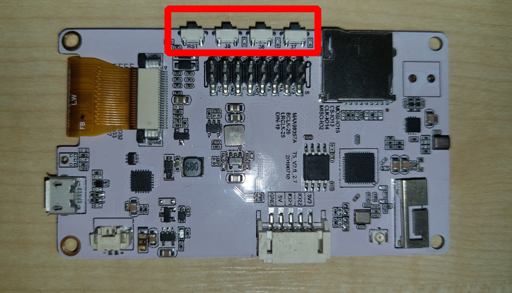

# Vstupy panelu

K&nbsp;desce LilyGo jsou připojena tři&nbsp;uživatelská tlačítka a&nbsp;jedno tvrdé reset tlačítko. Tento vstupní modul by měl zajišťovat příjem podnětů, která následně vyvolají změny v&nbsp;aplikaci. První tlačítko slouží k&nbsp;přepínání aplikací (modulů) na displeji. Zbylá dvě tlačítka slouží k&nbsp;ovládání aplikací (přepínání nastavení).

Po stisknutí tlačítka je automaticky zavolán callback neboli zpětné volání, které je specifické pro každou aplikaci.

Druhým řídícím prvkem je ubíhající čas. Panel si automaticky hlídá čas a&nbsp;v&nbsp;přednastavenou periodu vyvolá obnovení a&nbsp;aktualizaci dat.

Aplikaci zatím ve svém projektu nevyužívám. Do budoucna by na ní mohla být uložená nějaká konfigurace.
