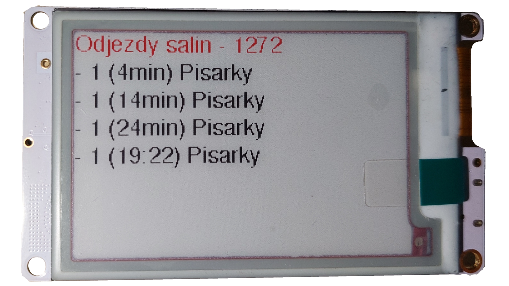

# Vykreslování panelu

O práci s displejem se stará knihovna [GxEPD](https://github.com/ZinggJM/GxEPD), která je obalená mojí třídou `DisplayManager`.

## [GxEPD](https://github.com/ZinggJM/GxEPD)

Univerzální knihovna GxEPD pro práci s mnoha E-paper displeji je založená a velmi rozšířené knihovně [Adafruit GFX Library](https://github.com/adafruit/Adafruit-GFX-Library).
Tato knihovna zvládá řídit více než 20 různých E-paper displejů s rozlišným počtem barev.
Komunikace mezi knihovnou a displejem probíhá skrze sběrnici SPI.

## [Adafruit GFX Library](https://github.com/adafruit/Adafruit-GFX-Library)

Tato univerzální knihovna se využívá jako základ pro většinu dalších knihoven, které pracují s různými displeji.

Knihovně totiž stačí zadefinovat jakým způsobem má vykreslovat jeden bod a čáru (horizontální + vertikální) a s těmito metodami již dokáže vykreslovat všemožné tvary.

## Virtuální displej

Díky univerzálnosti `Adafruit GFX` knihovny je možně testovat vykreslování i na počítači.
Pro otestování jsem využil projekt [Adafruit_GFX_dummy_display](https://github.com/croutor/Adafruit_GFX_dummy_display).

