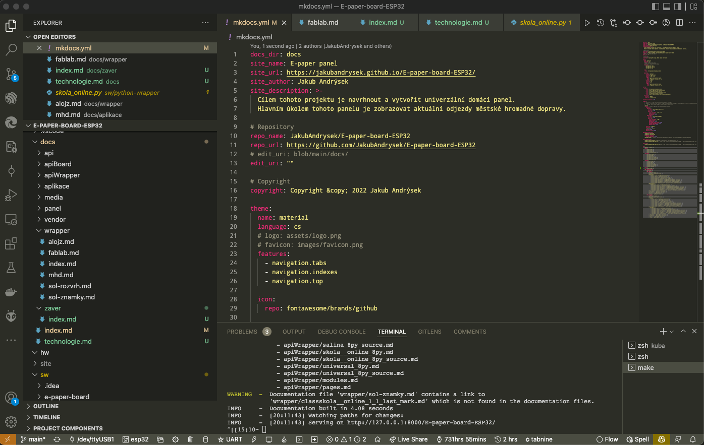

# Technologie

Jedním z cílů, které jsem si pro tento projekt vytyčil bylo vyzkoušet si nové technologie a prozkoumat jejich možnosti.
Během tvorby projektu jsem si procvičil práci v pěti programovacích a značkovacích jazycích.

## Panel

Software pro zobrazovací panel jsem tvořil v jazyce [C++](https://en.wikipedia.org/wiki/C%2B%2B).
Při návrhu aplikačních modulů jsem využil dědičnosti, díky které je velmi jednoduché rozšiřovat aplikace a doplňovat do nich společné vlastnosti. 

## Wrapper

Wrapper tvoří komunikační vrstvu mezi panelem a zdrojovými servery.
Pro jeho vytvoření jsem zvolil jazyk [Python](https://www.python.org/) a knihovnu [Flask](https://flask.palletsprojects.com/).
Ta zprostředkovává webový server, který přijímá požadavky z panelu a vrací JSON odpověď.
O HTTP dotazy se stará knihovna [requests](https://docs.python-requests.org/en/master/).

## Dokumentace
Pro tvorbu dokumentace jsem zvolil nástroj [MkDocs](https://mkdocs.org/), který se mi osvědčil na předchozích projektech.
MkDocs je nástroj vytvořený v jazyce Python a existuje do něj velké množství rozšiřujících pluginů.

### MkDoxy

[MkDoxy]() je můj doplněk do MkDocs, který má za úkol vytvářet kódovou dokumentaci.
Plugin je postaven na populárním nástroji [Doxygen](https://www.doxygen.org/), který vygeneruje XML soubory, ze kterých následně vzniká API dokumentace zdrojového kódu.