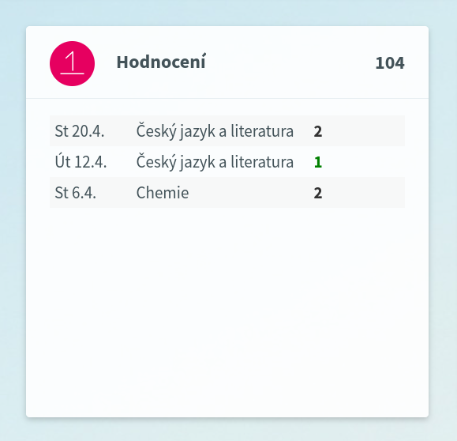

# ŠOL známky




## Vstupní HTML data

```html
...
<table class="smallTable hodnoceniTable" border="0">
	<tr>
		<td>St 20.4.</td><td title="Český jazyk a literatura">Český jazyk a literatura</td><td><a title="2" onclick="window.open(&#39;../Hodnoceni/KHO010_HodnVypisDetail.aspx?UdalostID=C35507599&amp;OsobaID=C3023618&#39;, &#39;detail&#39;, &#39;width=430, height=400, resizable, scrollbars&#39;)"><strong>2</strong></a></td>
	</tr><tr>
		<td>Út 12.4.</td><td title="Český jazyk a literatura">Český jazyk a literatura</td><td><a title="1" onclick="window.open(&#39;../Hodnoceni/KHO010_HodnVypisDetail.aspx?UdalostID=C35492215&amp;OsobaID=C3023618&#39;, &#39;detail&#39;, &#39;width=430, height=400, resizable, scrollbars&#39;)"><span class=' znamka_dobra'><strong>1</strong></span></a></td>
	</tr><tr>
		<td>St 6.4.</td><td title="Chemie">Chemie</td><td><a title="2" onclick="window.open(&#39;../Hodnoceni/KHO010_HodnVypisDetail.aspx?UdalostID=C35397815&amp;OsobaID=C3023618&#39;, &#39;detail&#39;, &#39;width=430, height=400, resizable, scrollbars&#39;)"><strong>2</strong></a></td>
	</tr>
</table>
...
```

## Wrapper LastMark

::: doxy.apiWrapper.Class.Method
    name: "skola\\_online::LastMark"
    method: "def __init__(self, str date, str subject, str mark)"
    description: True
    include: False

## Výstupní JSON

```json
[
	{
		"date": "St 20.4.",
		"subject": "Český jazyk a literatura",
		"mark": "2"
	},
	{
		"date": "Út 12.4.",
		"subject": "Český jazyk a literatura",
		"mark": "1"
	},
	{
		"date": "St 6.4.",
		"subject": "Chemie",
		"mark": "2"
	}
]
```